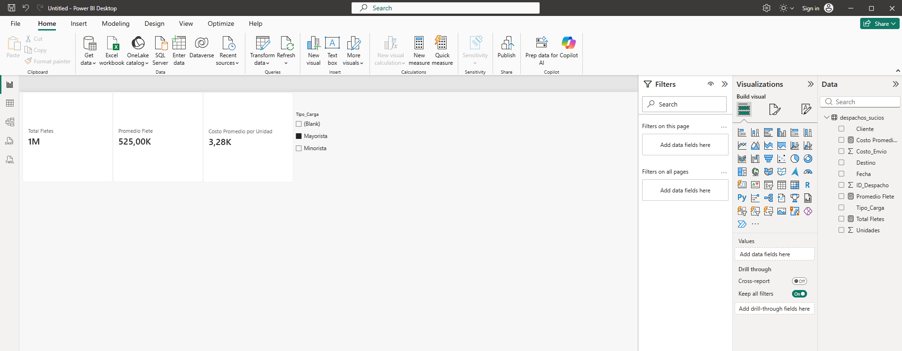

# Actividad Calificable · Corte 2 — Mini-ETL y primeras medidas

**Estudiante:** Dylan Solano Salazar 
**Asignatura:** Inteligencia de Negocios  
**Semana:** 04  

---
## Evidencias de Trabajo

### 1. Transformaciones en Power Query

### 2. Medidas DAX y Contexto de Filtro

---

## ETL steps & measures

In this project, a raw CSV dataset containing freight shipping operations was imported and transformed using Power Query.
First, explicit data types were assigned to numerical amounts, integer quantities, and dispatch dates.
Second, duplicated records were removed based on the dispatch unique identifier `ID_Despacho`. Third,
text formatting was applied to the customer column by trimming unnecessary leading/trailing spaces and capitalizing each word. 
Fourth, a conditional column named `Tipo_Carga` was created to classify orders into "Mayorista" or "Minorista" based on the unit volume.
Finally, three DAX measures were constructed to evaluate business performance: 
`Total Fletes` using `SUM`, `Promedio Flete` using `AVERAGE`, and `Costo Promedio por Unidad` using `DIVIDE` to prevent division-by-zero errors during dynamic filter interactions.
